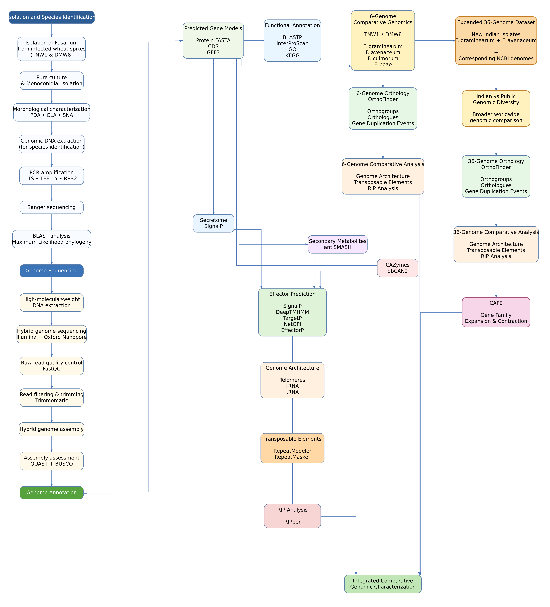

# Fusarium Comparative Genomics

This repository contains the reproducible computational workflows, scripts, metadata, and figure-generation code used for comparative genomic analyses of wheat-infecting *Fusarium* species.

## Overall Workflow

The overall experimental and computational workflow used in this study is shown below.



## Repository Structure

```text
```text
Fusarium-comparative-genomics/
│
├── 01_Genome_Quality/
│   └── BUSCO/
│
├── 02_Phylogeny/
│
├── 03_OrthoFinder_6_Genomes/
│
├── 04_OrthoFinder_36_Genomes/
│
├── 05_CAFE5_Gene_Family_Evolution/
│
├── 06_ncRNA/
│
├── 07_Transposable_Elements/
│
├── 08_RIP_Analysis/
│
├── 09_McClintock/
│
├── 10_KEGG/
│
├── 11_Genome_Circos_Plot/
│
├── 12_Telomere_Analysis/
│
├── 13_Effector_Prediction/
│
├── 14_ARI_Wheat_Pathology_Functional_Annotation/
│   ├── README.md
│   │
│   ├── app/
│   │   └── pipeline.py
│   │
│   ├── modules/
│   │   ├── blast_annotation.py
│   │   ├── check_resources.py
│   │   ├── excel_output.py
│   │   ├── fasta_qc.py
│   │   ├── go_annotation.py
│   │   ├── goslim.py
│   │   └── project_output.py
│   │
│   ├── config/
│   │   ├── config.yaml
│   │   └── resources.local.example.yaml
│   │
│   ├── install.sh
│   ├── fusarium_annotator.sh
│   └── .gitignore
│
├── results/
│   └── TE_RIP/
│
├── workflow.png
├── README.md
├── CITATION.cff
├── LICENSE
└── .gitignore
```

```

## Analysis Modules

| Module | Purpose |
|---|---|
| `01_Genome_Quality/BUSCO` | Genome and predicted-protein completeness assessment |
| `02_Phylogeny` | Multi-gene phylogenetic analysis and visualization |
| `03_OrthoFinder_6_Genomes` | Orthology and phylogenomics analysis of six genomes |
| `04_OrthoFinder_36_Genomes` | Comparative orthology and phylogenomics across 36 genomes |
| `05_CAFE5_Gene_Family_Evolution` | Gene-family expansion and contraction analysis |
| `06_ncRNA` | Non-coding RNA annotation and analysis |
| `07_Transposable_Elements` | Transposable-element annotation and summary |
| `08_RIP_Analysis` | Repeat-induced point mutation and RIP–TE analysis |
| `09_McClintock` | Transposable-element insertion analysis |
| `10_KEGG` | KEGG/KO annotation and pathway analysis |
| `11_Genome_Circos_Plot` | Whole-genome circular visualization of selected *Fusarium* isolates and genomic features |
| `12_Telomere_Analysis` | Identification and analysis of telomeric repeats |
| `13_Effector_Prediction` | Preparation of protein sequences for downstream effector prediction |
| `14_ARI_Wheat_Pathology_Functional_Annotation` | Functional annotation of fungal protein sequences using BLASTP, InterProScan 6, InterPro-to-GO, GO and GO-Slim annotation |

## ARI Wheat Pathology Functional Annotation Suite

The `14_ARI_Wheat_Pathology_Functional_Annotation` module provides an integrated workflow for functional annotation of fungal protein sequences.

### Pipeline

1. FASTA quality control
2. BLASTP against UniProtKB/Swiss-Prot
3. InterProScan 6 analysis
4. InterPro-to-GO annotation
5. GO annotation
6. GO-Slim annotation
7. Excel report generation
8. Raw result generation
9. Analysis logging

### KAAS → KEGG Pathway Analyzer

The `10_KEGG` module also contains the locally developed **KAAS → KEGG Pathway Analyzer** for automated downstream processing of completed KAAS results.

The analyzer processes protein-to-KO assignments, validates protein IDs against the original FASTA when supplied, retrieves KO, EC/enzyme and KEGG pathway information, maps annotations to proteins, and generates integrated Excel results.

It was developed to simplify processing of multiple fungal genomes and reduce repetitive manual handling of KAAS and KEGG annotation results.

### Developed at

**Wheat Pathology Laboratory**  
**Agharkar Research Institute, Hol, Baramati, Pune**

**Developed by:**  
**Dr. Sudhir Navathe**  
**Govardhan Choppadandi**

### Citation

**To be updated after publication.**

The citation information will be added to the software documentation and `CITATION.cff` after publication of the associated work.

## Data Organization

Input datasets, metadata, accession information, and analysis outputs are organized separately from computational scripts.

* `data/` contains metadata and input information required to reproduce analyses.
* `results/` contains selected derived tables and summary results.
* `supplementary/` contains supplementary tables associated with the manuscript.
* Large raw genome/protein datasets and computationally generated intermediate files are not included unless explicitly stated.

## Reproducibility

Each analysis module contains its own `README.md` where applicable. These files document the relevant software, parameters, input requirements, scripts, and expected outputs for that analysis.

The repository is intended to provide a transparent record of the computational workflows supporting the associated publication.
